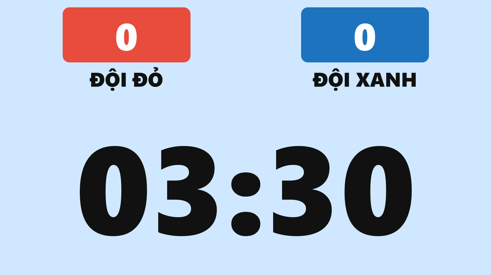
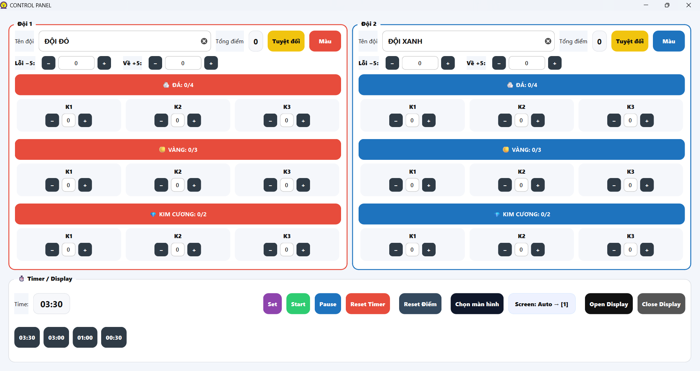
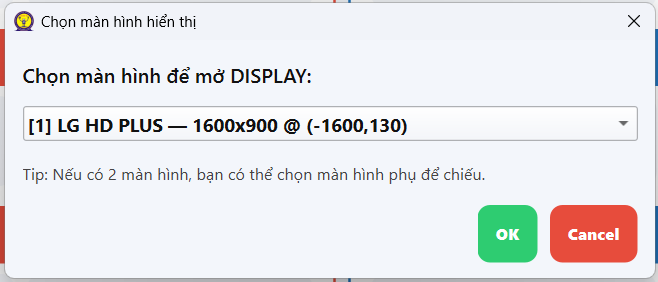

# CountdownTimer — Treasure Hunt 2025 ⏳🤖🏴‍☠️

A **PyQt6** app built for the **UNETI Mini Robot Contest**, organized by the **Department of Electrical Engineering & Automation (UNETI)**, used in the mini game **“Treasure Hunt 2025”**.

The app includes:
- **CONTROL PANEL** (for the organizers): control the timer, set team names, and score points.
- **DISPLAY** (fullscreen projector view): show **countdown timer + scoreboard** on a big screen.

---

## Key features

- **Two windows**
  - **CONTROL PANEL**: edit team names, adjust score, set timer, choose display monitor, open/close Display.
  - **DISPLAY (fullscreen)**: shows **2 teams + score + timer**.
- **Treasure-based scoring**
  - 3 treasure types: **STONE / GOLD / DIAMOND**
  - 3 treasure caches (kho): **K1 / K2 / K3**  
    > **K1 = Cache 1 (Kho 1)**, **K2 = Cache 2 (Kho 2)**, **K3 = Cache 3 (Kho 3)**.
  - Each cache has a total limit (stone + gold + diamond) of **max 3**.
  - Each team has per-type quotas (default): **stone 4**, **gold 3**, **diamond 2**.
- **Default points**
  - Stone: K1=5, K2=7, K3=10
  - Gold: K1=15, K2=17, K3=20
  - Diamond: K1=30, K2=32, K3=35
- **Quick adjustments**
  - **−5** penalty (unlimited)
  - **+5** bonus (unlimited)
  - **“Absolute win”** button to force the displayed result to 1–0 / 0–1 (useful to finalize an absolute win).
- **Timer**
  - Set time as `m:s` or input **seconds**
  - Quick presets: 03:30 / 03:00 / 01:00 / 00:30
  - Plays a sound in the **last 3 seconds** and when **time is up** (if audio files exist).
- **Presentation support**
  - Choose which monitor to use for the fullscreen Display (for dual-screen setups).
  - Display opens fullscreen on the selected monitor.

---

## Requirements

- Python **3.10+**
- Dependencies are listed in `requirements.txt` (already included in this repo).

Install dependencies:

```bash
pip install -r requirements.txt
```

---

## Run

```bash
python main.py
```

---

## Assets folder (icon + audio)

The app searches for assets in `./assets/` (and also supports bundled paths when built into an exe).

Suggested structure:

```text
CountdownTimer_Truy_Tim_Kho_Bau_2025/
├─ main.py
├─ requirements.txt
└─ assets/
   ├─ timer.ico            # app icon (optional)
   ├─ 3.wav (or 3s.wav)    # last-3-seconds sound (optional)
   └─ end.wav              # time-up sound (optional)
```

---

## Quick usage (Organizers)

1. Launch the app → set **Team Names** in the CONTROL PANEL.
2. Press **Set** to set the timer (or pick a preset).
3. Press **Open Display** to open the fullscreen projector window.
4. Press **Start** to run the countdown.
5. During the match:
   - Add treasures for each team by cache (K1/K2/K3) and type (stone/gold/diamond).
   - Use **−5 / +5** if needed.
   - If using two monitors, select the target screen before opening Display.
6. Use **Pause/Continue** to pause/resume.

---

## Keyboard shortcuts

### CONTROL PANEL
- `Space`: Pause / Continue
- `S`: Start
- `P`: Pause (force pause)
- `C`: Continue (resume)
- `R`: Reset Timer
- `D`: Open Display
- `Q`: Quit app

### DISPLAY
- `F` or `F11`: Fullscreen
- `Esc` or `Q`: Close Display

---

## Build standalone (PyInstaller) — optional

Install PyInstaller:

```bash
pip install pyinstaller
```

Build (Windows):

```bash
pyinstaller --noconsole --onefile ^
  --add-data "assets;assets" ^
  --icon "assets/timer.ico" ^
  main.py
```

Build (macOS/Linux):

```bash
pyinstaller --noconsole --onefile \
  --add-data "assets:assets" \
  --icon "assets/timer.ico" \
  main.py
```

## Demo — Screenshots

> These screenshots illustrate how the app looks: the CONTROL PANEL, the DISPLAY (fullscreen), and the Screen Select dialog.

### DISPLAY (fullscreen)
<p align="center">
  <a href="assets/1.png">
    
  </a>
</p>
<p align="center"><em>DISPLAY (fullscreen) — large clock and scoreboard intended for projector output.</em></p>

### Control panel & Screen Select
<p align="center">
  <a href="assets/3.png">
    
  </a>
  &nbsp;&nbsp;
  <a href="assets/2.png">
    
  </a>
</p>
<p align="center"><em>Left: Control Panel — set teams, time and scores. — Right: "Screen Select" dialog for choosing the target monitor.</em></p>

---

## Suggested GitHub “About” description

**PyQt6 countdown timer & scoring overlay for the UNETI Mini Robot Contest — Treasure Hunt 2025 (control panel + fullscreen display).**

Topics: `pyqt6`, `countdown-timer`, `scoreboard`, `robotics`, `competition`, `uneti`, `fullscreen-display`, `multi-monitor`

---

## License


This project is licensed under the **MIT License** — see the [LICENSE](LICENSE) file for details.
